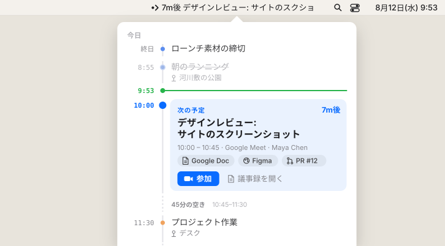

<p align="center">
  
</p>

<h1 align="center">Until</h1>

<p align="center">
  <strong>次の予定を、いつもメニューバーに。</strong><br />
  macOS のメニューバーに次の会議までのカウントダウン。クリックすれば一日がひとつのタイムラインに。議事録はワンクリックで。
</p>

<p align="center">
  <a href="https://github.com/combinatrix-ai/until/releases/latest/download/Until.dmg"><strong>macOS 版をダウンロード</strong></a>
  · <a href="https://until.combinatrix.ai/ja/">Webサイト</a>
  · <a href="README.md">English</a>
</p>

<p align="center">
  
</p>

## インストール

**ダウンロード:** [`Until.dmg`](https://github.com/combinatrix-ai/until/releases/latest/download/Until.dmg) を開き、`Until.app` をアプリケーションフォルダへドラッグします。Apple の公証済みで、アップデートは自動です。

**Homebrew:**

```sh
brew install --cask combinatrix-ai/tap/until
```

無料・オープンソース。macOS 13 以降、Apple シリコンと Intel の両方に対応。

## Until の特徴

- **カウントダウンはいつも目に入る場所に。** 次の予定をメニューバーに表示し、始まったら残り時間に切り替わります。⌥クリックか参加ショートカットで、すぐ会議に入れます。
- **一日をひとつのタイムラインで。** メニューバーをクリックすると、終わった予定・いまの時刻・この先の予定が一本のレールに並び、会議の間の空き時間も見えます。下部には今日の予定の件数・合計時間・残りの最長の空き時間を表示します。
- **議事録はワンクリック。** Google アカウントを接続すると、テンプレートから Google ドキュメントを作り、参加者と共有して、予定に添付するまでをワンクリックで行います。次の予定のカードには、招待に含まれる資料・デザイン・PR へのリンクも表示します。

## 使えるカレンダー

- **このMacのカレンダー** — カレンダーAppに入っている予定（iCloud・Google・Outlook/Exchange・CalDAV）をそのまま表示します。サインイン不要で、予定がこのMacの外に送られることはありません。
- **Google アカウント** — 直接サインインすると（複数アカウント可）、議事録の作成と Google Meet リンクの追加ができます。

どちらか一方でも、両方でも使えます。両方に出てくる同じ予定は1つにまとめます。

## 機能

- **メニューバーのカウントダウン**。開始後は残り時間を表示。発表中は予定名を隠せます。
- **開始アラート**（任意）。会議の開始時に、浮動カードか、すべてのディスプレイへの全画面表示で知らせます。参加・1分後に再通知・閉じるを選べます。
- **ネイティブの通知**（スヌーズ付き）。
- **ワンクリック参加**。Google Meet・Zoom・Microsoft Teams・Webex・Slack ハドル・Discord・Jitsi・FaceTime など30以上のサービスに対応。Zoom と Teams はデスクトップアプリで開けます。
- **デスクトップウィジェット**で今日の予定を一覧。
- **細かいフィルター**。カレンダー・タイトル・参加者・自分の返答・長さなどのルールで、表示する予定を決められます。
- **接続前に試せる**サンプルの一日。
- グローバルショートカット、ログイン時に起動、アイコンの右クリックで表示を折りたたみ。
- **日本語と英語**に対応。

## よくある質問

**無料ですか？** はい。MIT ライセンスで、アカウント登録もサブスクリプションもありません。

**予定のデータはどこかに送られますか？** いいえ。Until のサーバーはありません。Mac のカレンダーは Mac の中で読み取り、Google のデータは Google の API から直接 Mac に届きます。サインイン情報は macOS のキーチェーンに保存します。詳しくは[プライバシーポリシー](https://until.combinatrix.ai/privacy.html)をご覧ください。

**Mac のカレンダーで使えるなら、Google にサインインする理由は？** 議事録ドキュメントの作成と Meet リンクの追加のためだけです。それ以外は Mac のカレンダーだけで使えます。

**会社の Google Workspace でサードパーティ製アプリが許可されていません。** 「このMacのカレンダー」を使ってください。仕事用カレンダーがカレンダーAppに入っていれば、Google へのサインインなしで表示できます。

**Outlook は使えますか？** Exchange や Microsoft 365 のアカウントをカレンダーApp（システム設定 → インターネットアカウント）に追加し、「このMacのカレンダー」をオンにしてください。

## ソースからのビルド

[CONTRIBUTING.md](CONTRIBUTING.md) を参照してください。

## ライセンス

[MIT](LICENSE)
