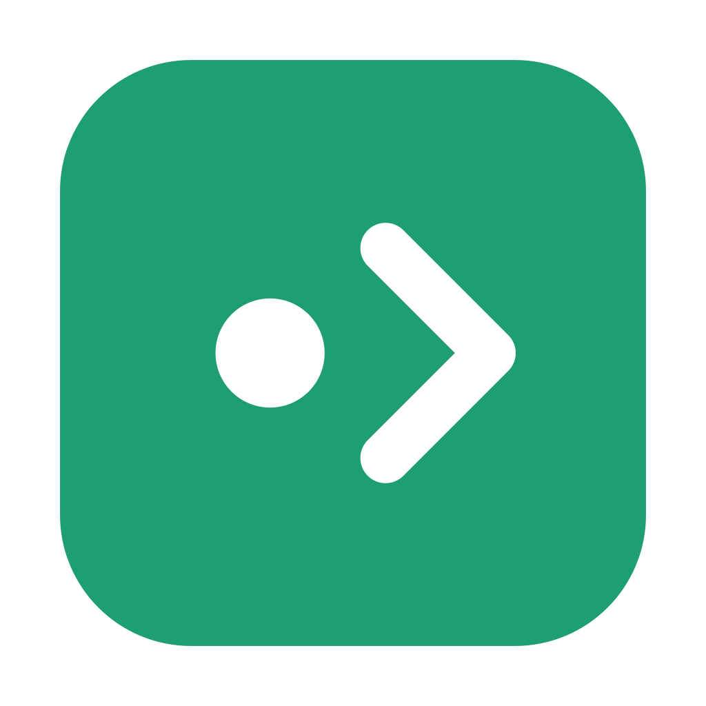
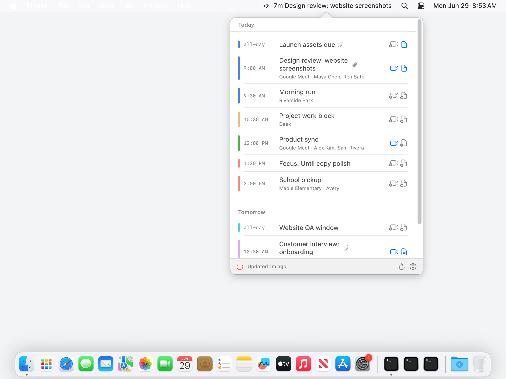

<p align="center">
  
</p>

# Until

**Next up, always visible.** Until keeps your next Google Calendar event in the
macOS menubar, with join links, meeting notes, reminders, and precise filters
close at hand.

Website: <https://combinatrix-ai.github.io/until/> ·
Privacy policy: <https://combinatrix-ai.github.io/until/privacy.html>

<p align="center">
  
</p>

## Features

- **Menubar countdown** — the next event stays in the menubar all day with a
  live countdown, then shows the time remaining once the meeting starts.
- **One-click join** — click an event's meeting link, or option-click the
  menubar item to join the next meeting instantly (Meet, Zoom, Teams,
  Whereby, and friends).
- **Native reminders** — sleep-safe notifications before events, with snooze.
- **Meeting notes** — create a Google Doc per meeting from your own templates,
  organized in an app-managed Drive folder.
- **Precise filters** — a structured rule builder decides which events count
  (by calendar, title, attendees, response status, and more).
- **Quick access** — global hotkey, launch at login, event context menus.
- **Localized** — English and Japanese.
- **Private by design** — OAuth tokens live in the macOS Keychain, the Drive
  scope is the non-sensitive `drive.file` tier (the app only sees files it
  created), and there are no servers: your data goes straight from Google's
  APIs to your Mac.

## Install

Download the latest notarized build from
[Releases](https://github.com/combinatrix-ai/until/releases/latest), open the
`.dmg`, and drag `Until.app` into `/Applications`.

Requires macOS 13 or later.

## Build from source

Until is a plain SwiftPM package (Swift + SwiftUI/AppKit).

```sh
swift build            # compile
swift run Until        # run the bare executable
scripts/dev.sh         # rebuild + relaunch as a real .app bundle (recommended)
scripts/package-app.sh # produce .build/debug/Until.app
```

Google sign-in needs your own OAuth desktop client (one-time setup):

1. In Google Cloud Console, create a project, enable the **Google Calendar
   API** (and the Drive/Docs APIs if you use meeting notes), and create an
   OAuth client ID of type **Desktop app**.
2. `cp .env.example .env` and fill in `GOOGLE_OAUTH_CLIENT_ID` /
   `GOOGLE_OAUTH_CLIENT_SECRET`. The packaging script bakes them into the
   app's `Info.plist`; `.env` is gitignored.

See [AGENTS.md](AGENTS.md) for the full development notes, including the
distributable (Developer ID + notarization) build via `scripts/release.sh`.

## License

[MIT](LICENSE)
