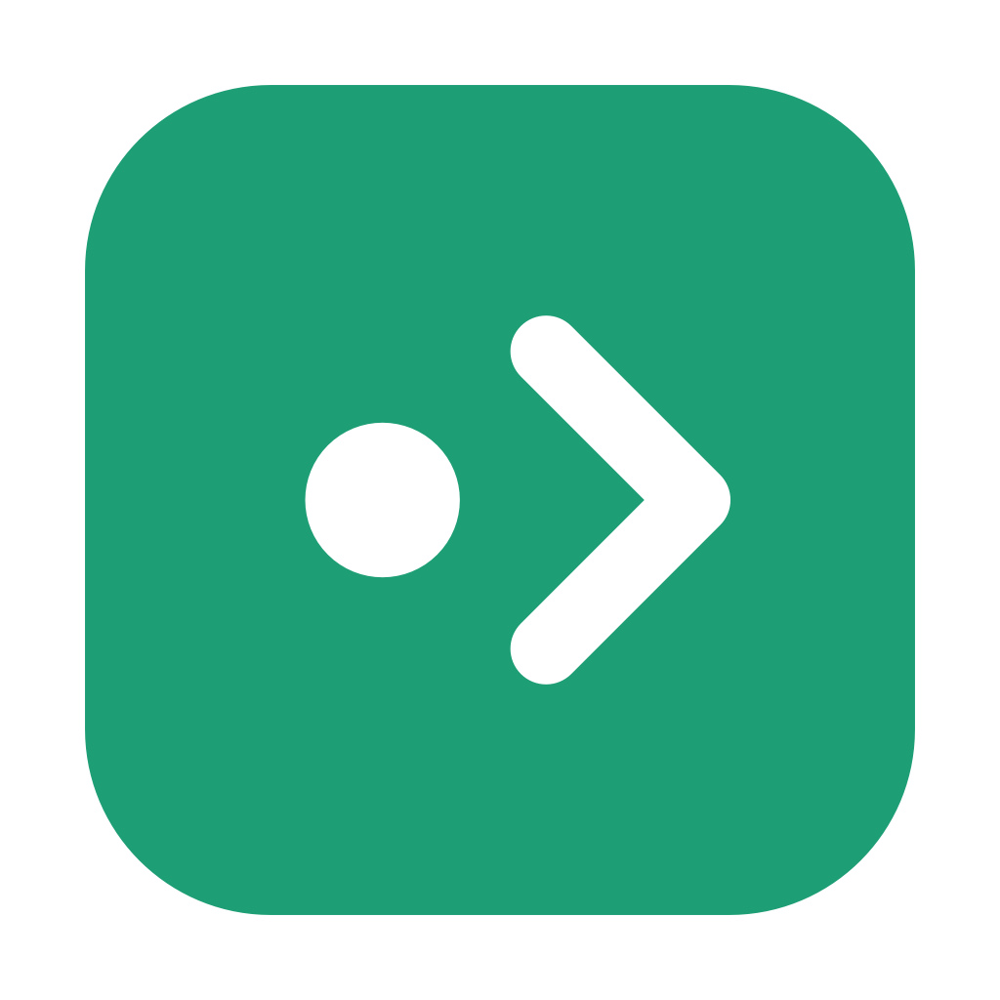
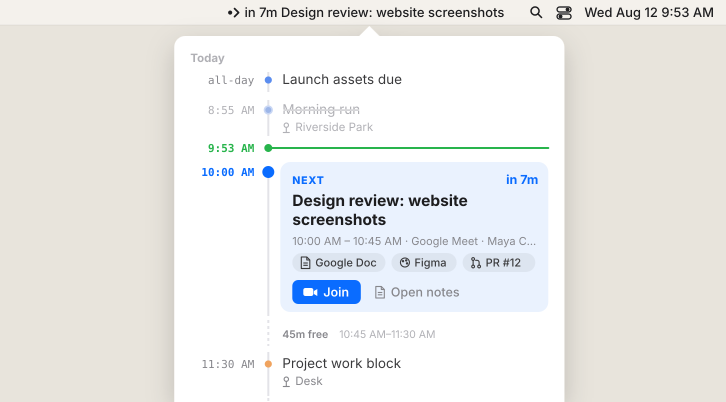

<p align="center">
  
</p>

<h1 align="center">Until</h1>

<p align="center">
  <strong>Next up, always visible.</strong><br />
  Your next meeting in the macOS menu bar — a live countdown, your whole day on one timeline, and meeting notes in one click.
</p>

<p align="center">
  <a href="https://github.com/combinatrix-ai/until/releases/latest"></a>
  
  
  <a href="LICENSE"></a>
</p>

<p align="center">
  <a href="https://github.com/combinatrix-ai/until/releases/latest/download/Until.dmg"><strong>Download for macOS</strong></a>
  · <a href="https://until.combinatrix.ai/">Website</a>
  · <a href="README.ja.md">日本語</a>
</p>

<p align="center">
  
</p>

## Install

**Download:** grab [`Until.dmg`](https://github.com/combinatrix-ai/until/releases/latest/download/Until.dmg),
open it, and drag `Until.app` into Applications. It is signed and notarized by
Apple and updates itself.

**Homebrew:**

```sh
brew install --cask combinatrix-ai/tap/until
```

Free and open source. macOS 13 or later, Apple Silicon and Intel.

## Why Until

- **The countdown, where you already look.** The next event sits in the menu
  bar with a live countdown and flips to time left once it starts. ⌥-click it,
  or press the join shortcut from anywhere, to jump into the call.
- **Your day on one timeline.** Click the menu bar and the whole day unfolds on
  a single rail: finished events above, the current moment in the middle, and
  free time called out between meetings. The footer sums the day up — how many
  events, how much is booked, and the longest free stretch left.
- **Meeting notes in one click.** With a Google account connected, one click
  creates a Google Doc from your template, shares it with the attendees, and
  attaches it to the event. The upcoming card also surfaces the docs, designs,
  and pull requests linked from the invite.

## Works with your calendars

- **Calendars on this Mac** — everything the Calendar app already syncs:
  iCloud, Google, Outlook/Exchange, CalDAV. No sign-in; events are read on your
  Mac and never leave it.
- **Google accounts** — sign in directly (several accounts at once) to add
  meeting notes docs and Google Meet links to events.

Use either, or both: events that show up through both are merged.

## Features

- **Menu bar countdown** that switches to time left once a meeting starts, and
  can hide the title while you present.
- **Start alert** (optional) — a floating card or a full-screen takeover on
  every display as a meeting starts, with Join, Snooze, and Dismiss.
- **Native reminders** before events, with snooze.
- **One-click join** for 30+ services — Google Meet, Zoom, Microsoft Teams,
  Webex, Slack huddles, Discord, Jitsi, FaceTime, Whereby, Around, and more.
  Zoom and Teams can open in their desktop apps.
- **Desktop widgets** with today's agenda.
- **Precise filters** — a rule builder decides which events count (calendar,
  title, attendees, your response, duration, and more).
- **Try before connecting** — a sample day shows the timeline before you pick a
  calendar.
- **Quick access** — global shortcuts, launch at login, right-click the icon to
  collapse it.
- **English and Japanese.**

## How it compares

| | Until | MeetingBar | Dato | Dot |
|---|---|---|---|---|
| Price | Free, open source | Free, open source | $18 | $14.99 |
| Calendars | macOS Calendar + Google sign-in | macOS Calendar + Google | macOS Calendar | macOS Calendar |
| Menu bar countdown | ✓ | ✓ | ✓ | ✓ |
| One-click join | ✓ | ✓ | ✓ | ✓ |
| Full-screen alert | ✓ | ✓ | ✓ | ✓ |
| Day view | One timeline with free time | Event list | Month + event list | Month + event list |
| Meeting notes doc (create, share, attach) | ✓ | — | — | — |
| Rule-based filters | ✓ | Toggles | — | — |

Based on each app's own website as of September 2026. They are all good apps;
Until is for people who want the shape of their day and their meeting notes
one click away.

## FAQ

**Is it free?** Yes. Until is MIT-licensed, with no account and no subscription.

**Does my calendar data go anywhere?** No. There is no Until server. Mac
calendars are read locally, Google data goes straight from Google's API to your
Mac, and sign-in tokens live in the macOS Keychain. See the
[privacy policy](https://until.combinatrix.ai/privacy.html).

**Why sign in with Google if the Mac calendars work?** Only for the Google
extras: creating meeting notes docs and adding Meet links. Everything else
works with the Mac calendars alone.

**My company's Google Workspace blocks third-party apps.** Use Calendars on
this Mac — if your work calendar is in the Calendar app, Until can show it
without any Google sign-in.

**Outlook?** Add your Exchange or Microsoft 365 account to the Calendar app
(System Settings → Internet Accounts), then turn on Calendars on this Mac.

## Build from source

See [CONTRIBUTING.md](CONTRIBUTING.md).

## License

[MIT](LICENSE)
